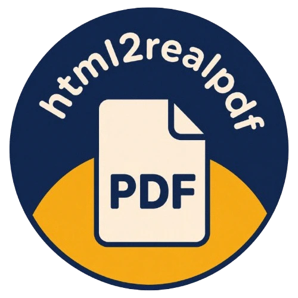

<div align="center">
  
  <h1>html2realpdf</h1>
  <p><strong>A real PDF, not a screenshot.</strong></p>
  <p>
    <a href="https://github.com/imggion/html2realpdf/releases/tag/0.1.0-rc3"></a>
    
    
    
  </p>
  <p>
    Generate selectable, searchable, vector-based PDFs from HTML in the browser.<br>
    Written in Zig, compiled to WebAssembly, and packaged with a typed TypeScript API.
  </p>
</div>

## Contents

- [Why real PDFs](#why-real-pdfs)
- [Install](#install)
- [Quick start](#quick-start)
- [React](#react)
- [Vue](#vue)
- [Preview](#preview)
- [Page layouts](#page-layouts)
- [Benchmark](#benchmark)
- [Contributing](#contributing)
- [License](#license)

## Why real PDFs

Screenshot-based PDF tools turn a page into an image. `html2realpdf` keeps text
as text, links as PDF annotations, fonts as embedded subsets, and supported
graphics as vectors.

The text includes Unicode mappings, so people can select, copy, and search the
result. Tools and LLMs can read the document text without first running OCR.
Text-heavy documents are also often smaller and stay sharp at every zoom level.

Zig performs the layout and PDF writing, while WebAssembly brings the renderer
to the browser. The result is one portable pipeline for invoices, reports,
tickets, letters, slides, and other web-generated documents.

See the [CSS support matrix](docs/css-support.md) for the current layout and
rendering coverage. The RC provides machine-readable text and accessible
preview controls; it does not claim PDF/UA or fully tagged PDF compliance.

## Install

The release candidate is prepared for npm but is not published yet. Once it is
available, install the `next` release with your package manager:

```sh
npm install @imggion/html2realpdf@next
pnpm add @imggion/html2realpdf@next
yarn add @imggion/html2realpdf@next
bun add @imggion/html2realpdf@next
```

## Quick start

Render an HTML element, download the PDF, then release its resources:

```ts
import { renderPdf } from "@imggion/html2realpdf";

const invoice = document.querySelector<HTMLElement>("#invoice");
if (!invoice) throw new Error("Invoice not found");

const pdf = await renderPdf(invoice);
pdf.download("invoice.pdf");
pdf.dispose();
```

HTML strings are supported too:

```ts
const pdf = await renderPdf("<h1>Hello from a real PDF</h1>");
```

## React

Pass a ref to a mounted element. The package understands React-shaped refs
without depending on React itself.

```tsx
const reportRef = useRef<HTMLDivElement>(null);

async function downloadReport() {
  if (!reportRef.current) return;

  const pdf = await renderPdf(reportRef);
  pdf.download("report.pdf");
  pdf.dispose();
}

return <Report ref={reportRef} />;
```

`Report` can be a component that forwards its ref to its root element. Pass the
mounted ref, not an unmounted component definition.

## Vue

Pass the mounted DOM element behind a template ref. With Vue 3.5 or newer,
`useTemplateRef()` keeps the element typed without wrapping the renderer in a
Vue-specific adapter.

```vue
<script setup lang="ts">
import { useTemplateRef } from "vue";
import { renderPdf } from "@imggion/html2realpdf";

const report = useTemplateRef<HTMLElement>("report");

async function downloadReport() {
  if (!report.value) return;

  const pdf = await renderPdf(report.value);
  try {
    pdf.download("report.pdf");
  } finally {
    pdf.dispose();
  }
}
</script>

<template>
  <article ref="report">
    <h1>Quarterly report</h1>
    <p>This content stays selectable in the PDF.</p>
  </article>

  <button type="button" @click="downloadReport">Download PDF</button>
</template>
```

On Vue 3.4 or earlier, use
`const report = ref<HTMLElement | null>(null)` with the same template ref and
pass `report.value` to `renderPdf()`.

## Preview

The preview renders the actual generated PDF inside your page. It uses isolated
Shadow DOM and canvas pages instead of an iframe, browser PDF plugin, or fake
HTML copy.

```ts
const pdf = await renderPdf(invoice);
const previewTarget = document.querySelector<HTMLElement>("#pdf-preview");
if (!previewTarget) throw new Error("Preview target not found");

const preview = await pdf.preview(previewTarget, {
  initialScale: "fit-width",
});

// Later, when closing the preview:
preview.dispose();
pdf.dispose();
```

## Page layouts

Use the named `a4` and `letter` formats in portrait or landscape mode. A4
landscape works well for presentation decks:

```ts
const pdf = await renderPdf(slides, {
  page: {
    format: "a4",
    orientation: "landscape",
    unit: "mm",
    margin: [12, 12],
  },
});
```

For postcards or any other size, pass custom `[width, height]` dimensions:

```ts
const pdf = await renderPdf(postcard, {
  page: { format: [148, 105], unit: "mm", margin: 8 },
});
```

## Benchmark

One recorded run of the deterministic 30-page stress report produced:

| Engine | First PDF | Warm render | File size | Pages | Content model |
| --- | ---: | ---: | ---: | ---: | --- |
| `html2realpdf` | 1595.9 ms | 1451.2 ms | 441.1 kB | 30 | Native/selectable PDF |
| `html2pdf.js` | 2124.6 ms | 1952.4 ms | 3.11 MB | 30 | Raster image PDF |

**Main differences versus html2pdf.js**

- **33.1% faster first PDF**
- **34.5% faster warm render**
- **85.8% smaller file**

## Contributing

You need Zig `0.16.0`, Node.js `20.16+`, npm, and Make. On a fresh checkout,
install the JavaScript dependencies once:

```sh
npm ci --prefix bindings/js
npm ci --prefix tests/react
npm ci --prefix tests/web
```

| Command | Purpose |
| --- | --- |
| `make test` | Run the Zig and renderer tests |
| `make release` | Build the native release binary |
| `make wasm` | Build the default `ReleaseFast` WebAssembly and browser package |
| `make wasm-small` | Build the optional size-oriented `ReleaseSmall` package asset |
| `make react` | Start the React integration app |
| `make test-release` | Run the complete release gate |

To open the small browser test harness:

```sh
make wasm
python3 -m http.server 8765
```

Visit [http://localhost:8765/tests/web/index.html](http://localhost:8765/tests/web/index.html).

## License

The project code is released under the MIT License. See [LICENSE.md](LICENSE.md)
for the complete project and third-party license inventory.
